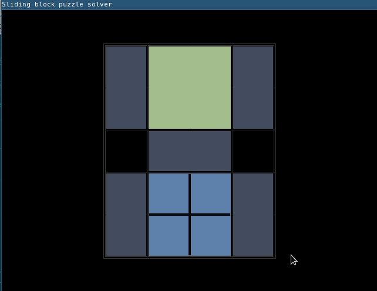

# *Sliding Block Puzzle*

The objective is to slide the blocks around so that the large square can slide through the hole at the bottom of the box.

Implemented by **Anderson Tan**

**Representation of the pieces:**

The starting configuration of the pieces: 

The purpose of this project is to compute a solution (if one exists) from any given starting position of the pieces. 

**Testing:**

* [x] You can drag the blocks around with the mouse, and if they are close to a grid corner, they will "snap" into place. 

* [x] If you right click a rectangle, it will toggle the orientation (horizontal vs vertical).

* [x] Give the puzzle an initial state, compile the project, and run the solver.

* [x] Press q or escape to quit the program (or just close it via your window manager.)

**Simulation:**

